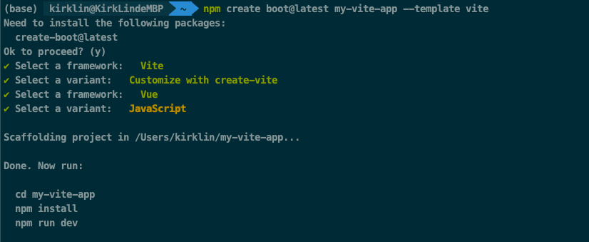

# create-boot

## Scaffolding Your First Web App Project



> **Compatibility Note:**
> requires [Node.js](https://nodejs.org/en/) version 18+, 20+. However, some templates require a higher Node.js version to work, please upgrade if your package manager warns about it.

With NPM:

```bash
$ npm create boot@latest
```

With Yarn:

```bash
$ yarn create boot
```

With PNPM:

```bash
$ pnpm create boot
```

With Bun:

```bash
$ bunx create-boot
```

Then follow the prompts!

You can also directly specify the project name and the template you want to use via additional command line options. For example, to scaffold a project, run:

```bash
# npm 7+, extra double-dash is needed:
npm create boot@latest my-app -- --template vue

# yarn
yarn create boot my-app --template vue

# pnpm
pnpm create boot my-app --template vue

# Bun
bunx create-boot my-app --template vue
```

Currently supported template presets include:

- `vue`
- `react`
- `kirklin`
- `vite`

You can use `.` for the project name to scaffold in the current directory.

## Thanks

This project is based on [create-vite](https://github.com/vitejs/vite/tree/main/packages/create-vite)
